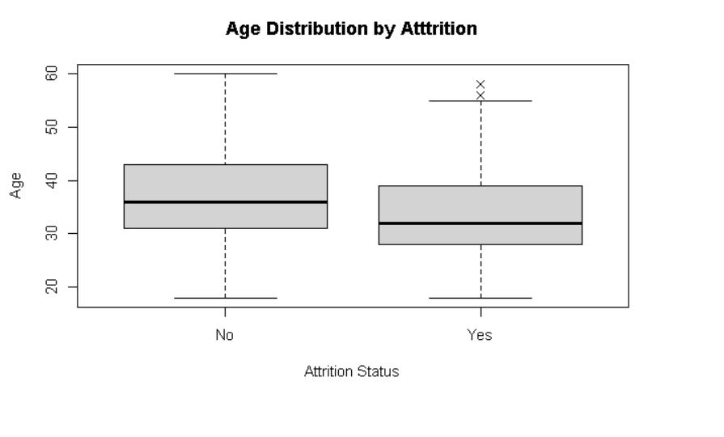

# HR-Attrition-R-Analysis
Statistical analysis of employee attrition using R (hypothesis testing and regression analysis)
HR Attrition Analysis in R
Project Overview

Employee attrition is an important challenge for organizations because losing employees increases recruitment costs and reduces productivity.

This project analyzes the IBM HR Analytics dataset to investigate factors associated with employee attrition using statistical analysis in R.

The analysis includes exploratory data analysis, hypothesis testing, and regression modeling.

Dataset

IBM HR Analytics Employee Attrition Dataset

• 1470 employees
• 35 variables

Key variables used:

Age

Attrition

MonthlyIncome

TotalWorkingYears

Analysis Performed

The analysis includes:

• Correlation analysis
• Scatterplot matrix visualization
• Hypothesis testing (Welch two-sample t-test)
• Linear regression
• Multiple linear regression
### Example Visualization

)
Key Findings

• Employees who left the company were younger on average

• Employee seniority was not statistically related to attrition

• Age and work experience strongly influence income

• Work experience is a stronger predictor of salary than age

Tools Used
cor()

pairs()

boxplot()

t.test()

lm()

Files in this Repository
HR_Attrition_Analysis.R   → R analysis code
plots/                    → visualizations
README.md                 → project documentation
Portfolio

Full project explanation available in my portfolio.
R (RStudio)

Base R functions:
